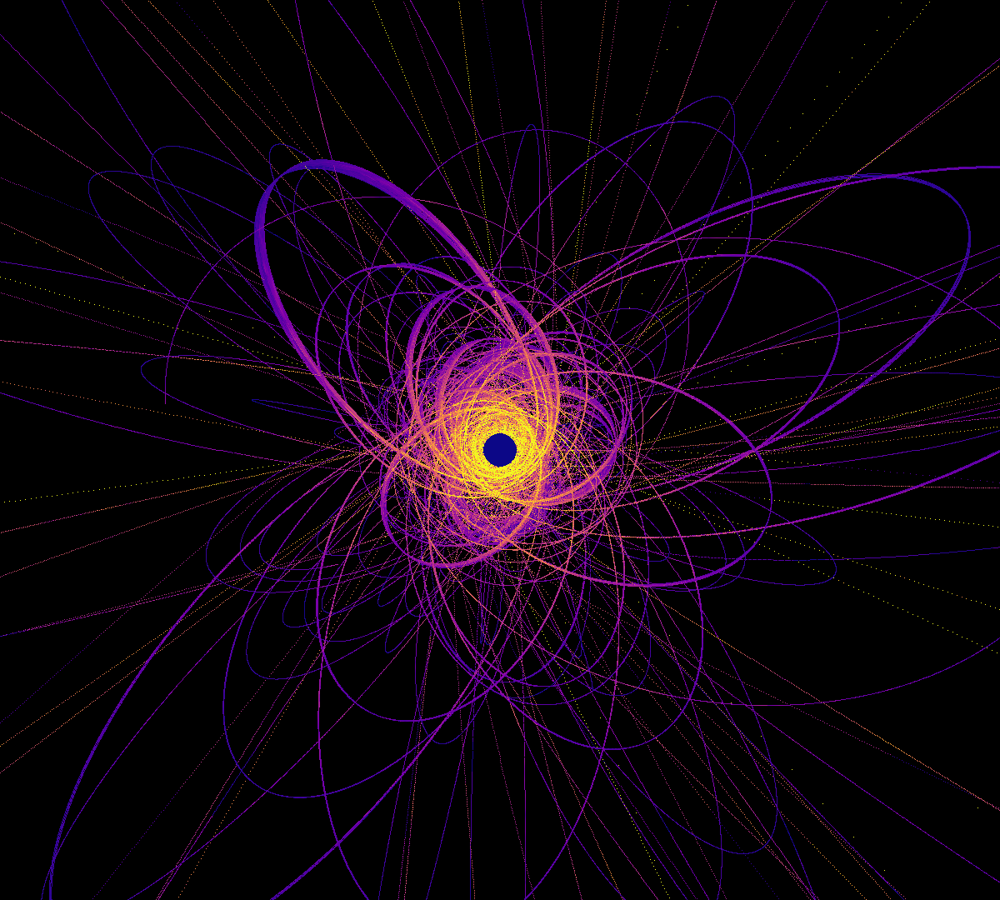
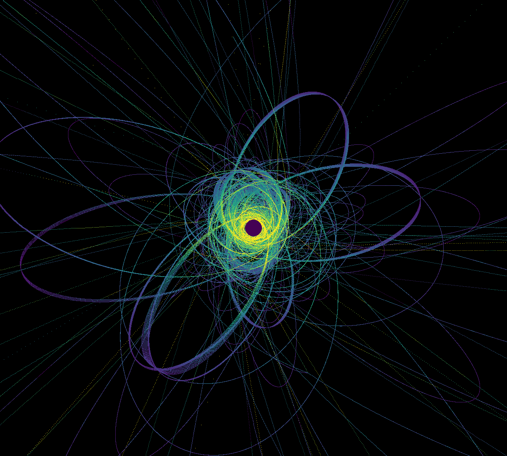
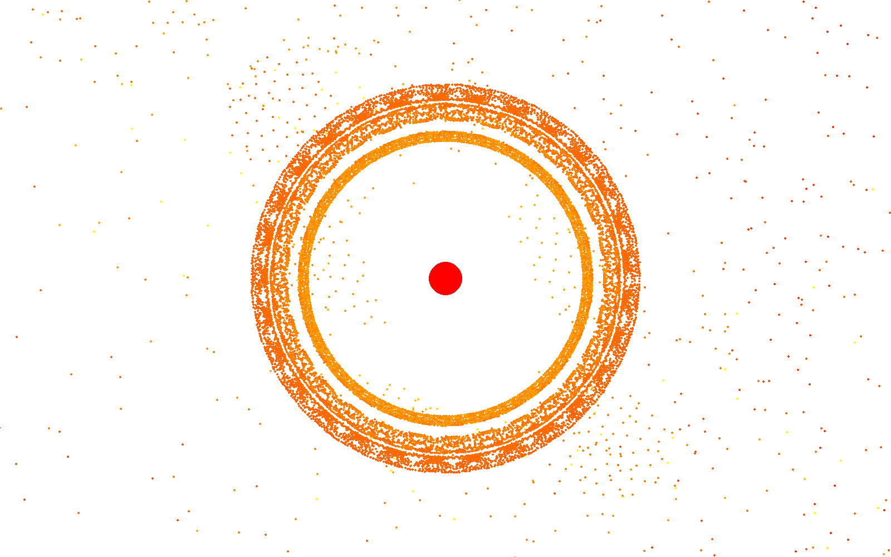
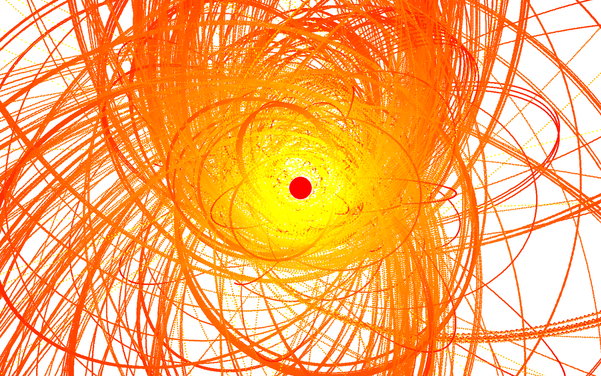

# particle-simulation
Simulation of particles in 2D space with collision and gravity

## about
I realized that my physics and math muscles were atrophying after working as a software engineer for so long, so I figured it would be cool to build a particle simulator to refresh some of my math and physics knowledge. This is really just a weekend project so I haven't added any of the usual stuff like linting, unit tests, proper logging, branch protection, PR validation, etc. I might add those later, but I've done those so many times at work that I'm kind of tired of it.

## running locally
I recommend using virtualenv. start a virtualenv at .venv, activate it, and then install the requirements from requirements.txt.
`python -m virtualenv .venv && .venv/scripts/activate && python -m pip install -r requirements.txt`

If using VS Code, you can run any of the pre-made launch configurations. Otherwise, you can invoke the script with
`python main.py {config file path} [--image-output -o {image output path}]`

Additionally, you can run `python main.py -h` to view cli args in case I forget to update the readme with them

## configuration
I plan on writing better documentation for the config file, but simulation parameters are specified as a JSON file of the format `GlobalConfig`, which is documented in `src/client/typings.py`. There are a handful of example descriptions in `config/`. 

here are the parameters:

`view_config`:
- `dimensions`: the literal size of the screen, in pixels
- `scale`: the ratio of pixel:simulation-distance-unit. smaller scale = zoom out. larger scale = zoom in
- `center_heaviest`: whether or not to center the viewport and velocity frame of reference on the most massive particle
- `exile_distance`: the distance (in simulation distance units) from the outside of the screen boundary at which particles should be discarded
- `color_velocity`: if true,  color the particles depending on their speed relative to the reference point
- `trace`: if true, don't clear the screen on every render
- `color_scheme`: the color scheme to use when coloring particles by their speed: [here is a list of color schemes that you can specify](https://matplotlib.org/stable/gallery/color/colormap_reference.html#sphx-glr-gallery-color-colormap-reference-py)
- `color_scale_velocity_bounds`: a tuple representing the absolute speed range used to color the particles when `color_velocity` is true, and `use_relative_color_scale` is false. particles with speed above the upper bound will be clipped to 1.
- `use_relative_color_scale`: if true, automatically determine a color scale at every render based on the min/max speeds at that instant. if false, use the `color_scale_velocity_bounds`
- `background_color_rgb`: a tuple of ints between 0 and 255 representing the RGB background color. defaults to [255,255,255]. 
- `default_particle_color_rgb`: a tuple of ints between 0 and 255 representing the RGB particle color. defaults to [0,0,0]. Only used if `color_velocity` is false. 

`client_config`:
- `simulation_time_per_frame`: this is the amount of simulation time that passes in each frame. a lower value means a higher-resolution (more accurate) simulation. 0.125 is a decent setting.
- `frames_per_second`: the target FPS for the simulation. For large simulations, it will actually be much slower
- `simulation_duration_seconds`: the number of "seconds" (actually in terms of frames) to run the simulation. it might take longer than the specified duration if it is an especially demanding simulation

`enable_collisions`: defaults to true. if false, collisions are disabled. this greatly speeds up the simulation but it, of course, disables collisions.

`gravitational_constant`: basically how strong gravity is. set it to 0 to disable gravity. set it to a negative number to get some weird results. generally, it should be a positive number.

`creation_config`: this defines how the particles are initially laid out. See types in `src/creator/typings.py` and the example configs for details. Maybe I'll write this out in more detail later.

## saving images
After the simulation is complete, you will be prompted to save the final screenshot.
Here are some examples:
### high simulation resolution and the "magma" color scheme

### "viridis" color scheme

### very low simulation resolution, collisions disabled, and the "autumn" color scheme

### high-ish simulation resolution, collisions enabled, and the "autumn" color scheme with an abosolute color scale, instead of relative

## todo: 
- eventually I plan to add a way to save the simulation as as CSV and have a separate script to play it back
- add linting/auto-formatting/unit tests/proper logging, etc.
- add branch policies, require PRs
- PR/CI
- finish documentation

## contribute
If you think this is cool and want to contribute or find an issue or have questions, feel free to create an issue or make a pull request.